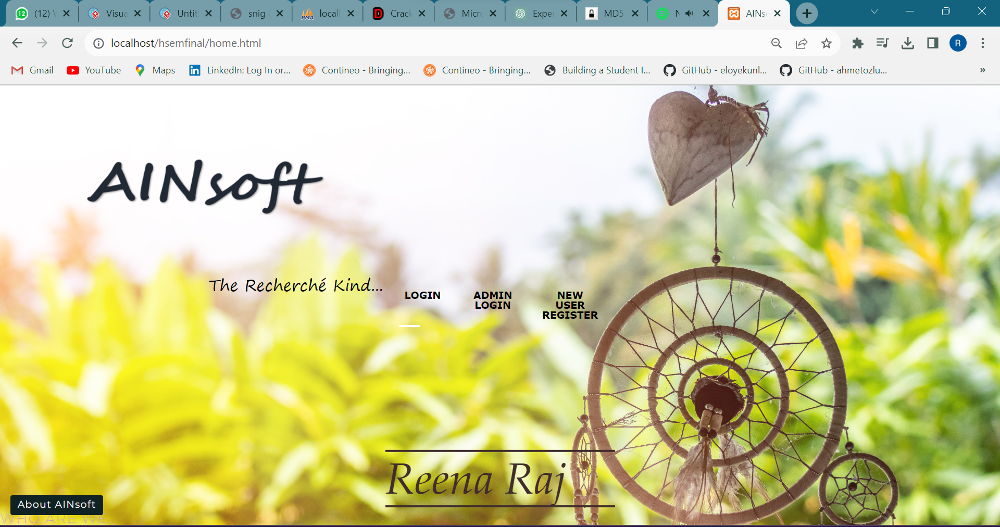
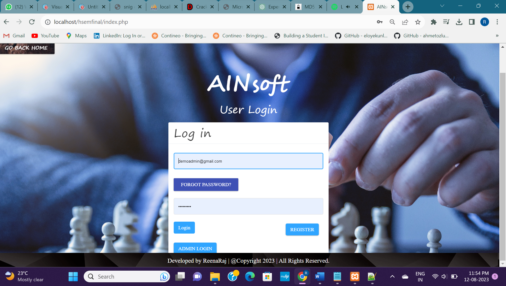
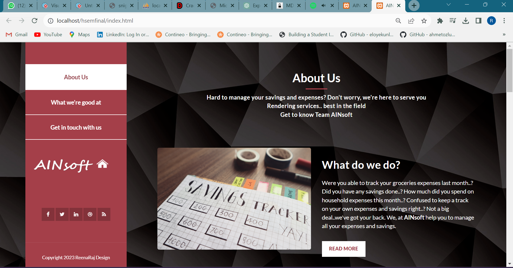
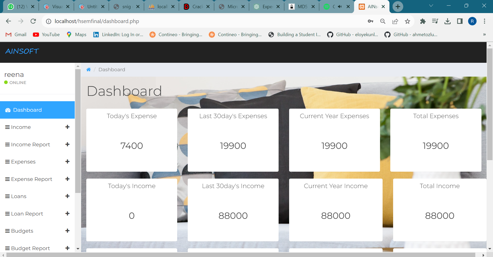
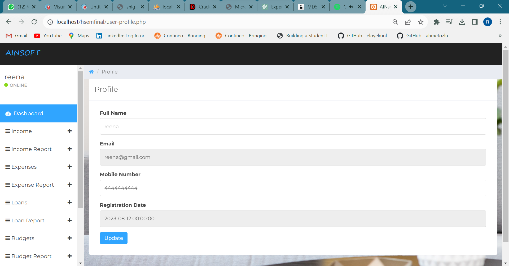
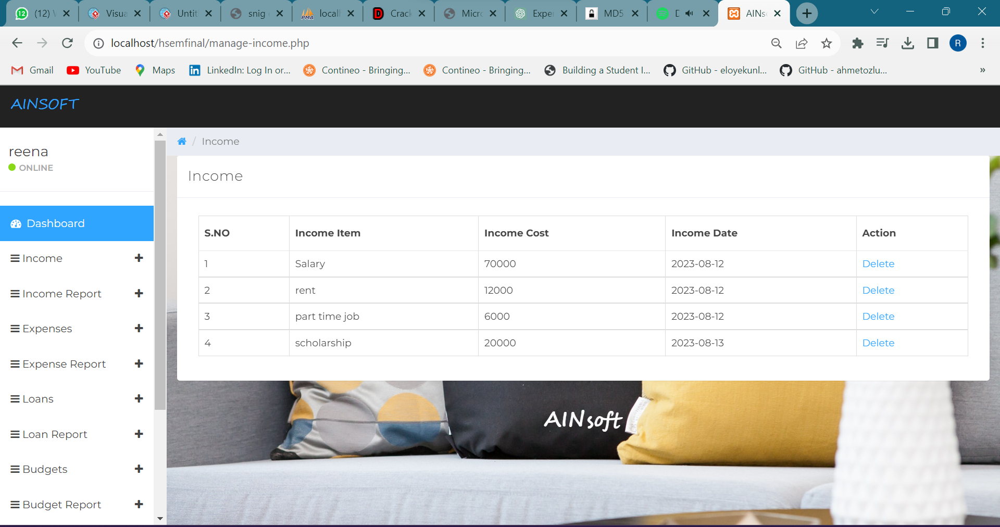
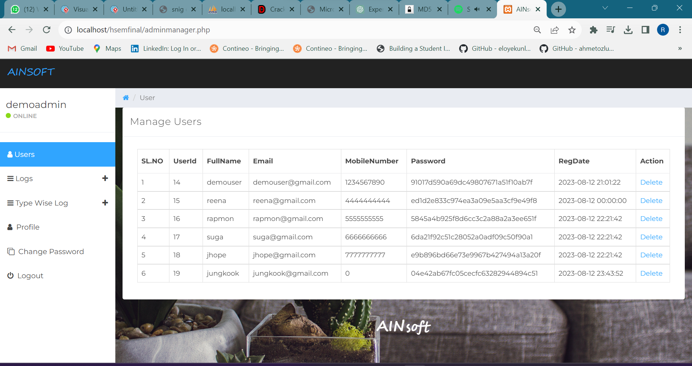

# Savings-Management-full stack-project

# AINSOFT - Savings and Expense Management

A Household savings and expenditure (HSE) management system for recording income, expenses, loans, and budget management.

## Table of Contents

- [Introduction](#introduction)
- [Problem Statement](#problem-statement)
- [Objectives](#objectives)
- [Scope](#scope)
- [Hardware and Software Specifications](#hardware-and-software-specifications)
- [Tech Stack](#tech-stack)
- [Conclusion](#conclusion)

## Introduction

A Household savings and expenditure (HSE) management System is a virtual place where one can record their income, expenses, loans, and budget on the go and also search for them easily.

### Problem Statement

The aim of this project is to address the challenges associated with household savings and expenditure management. It provides an opportunity for everyone to have some idea about expenses management.

### Objectives

- Review income, expenses, and savings over a given period of time.
- Judge the gap between actual expenditure and desired savings.
- Help in exercising household control.
- Strengthen management skills in maintaining expenses and savings.
- Provide clarity of income, expenditure, and savings.

### Scope

The Household savings and expenditure Management System is a system used to automate the process and management of all expenditures of an individual.

## Hardware and Software Specifications

### Hardware Requirement

- Processor – Pentium IV or above
- Ram – 2 GB or more

### Software Requirement

#### Server Side:

- XAMPP
- MySQL
- FTP accessibility to upload content to the server or modify them.
- Server running on Windows.

#### Client Side:

- Browser supporting HTML 5, PHP, and CSS 3
- Machine running Windows
- Internet connection

## Tech Stack

- MySQL
- PHP
- HTML/CSS
- JavaScript
- SQL queries

## Webpage snapshots

Users's pages

### Admin View

## Conclusion

The AINSOFT Savings and Expense Management website is designed to be easy to use and highly beneficial. The design considers all user needs and presents them in the best way possible, saving time and streamlining the entire process. The project has been successfully completed and tested with suitable test cases, providing a user-friendly experience.

This project aims to reduce paperwork and bring relative ease to managing large data in terms of expenses and income. It allows users to track old and new expenses, keep a list of all types of expenses and income information, and receive feedback from users. The website is part of a future where everything is easily accessible on the web.

## Author

Reena R
